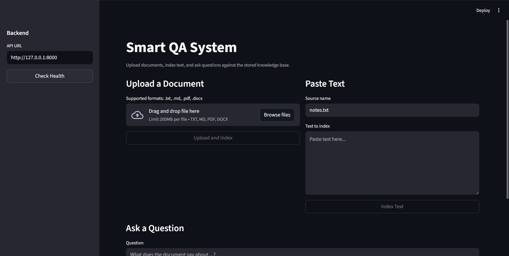
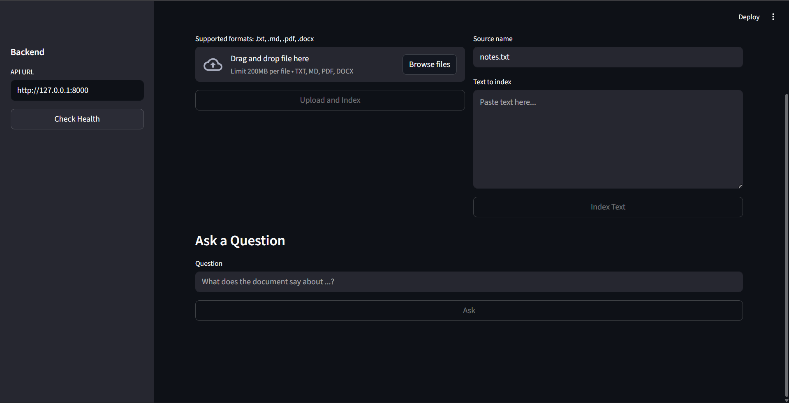

# Smart QA System

Smart QA System is a lightweight document question-answering application with a FastAPI backend and a Streamlit frontend. It lets you upload files or paste raw text, indexes the content locally, and returns extractive answers based on the most relevant matched chunks.

This version is designed to work offline for retrieval and answer composition. It does not currently require an OpenAI key to answer questions, although the project keeps room for later LLM integration.

## Features

- Upload and index `.txt`, `.md`, `.pdf`, and `.docx` files
- Paste raw text directly from the UI and index it without creating a file first
- Ask questions against all indexed content
- Return an extractive answer built from the most relevant matched sentences
- Show matching source documents and chunk excerpts
- Persist indexed chunks locally in `data/documents/index.json`
- Run a simple backend and frontend separately for local development
- Includes API tests for health, ingestion, and QA flow

## Screenshots

### Main dashboard



### Question input area



## Tech Stack

- Backend: FastAPI, Uvicorn, Pydantic
- Frontend: Streamlit, HTTPX
- Document parsing: `pypdf`, `python-docx`
- Retrieval: local chunking plus a simple lexical scoring store
- Testing: Pytest, FastAPI TestClient

## How It Works

The application follows a simple retrieval pipeline:

1. A document is uploaded or raw text is submitted.
2. The `DocumentProcessor` extracts and normalizes the text.
3. The text is split into overlapping chunks using sentence-aware chunking.
4. Chunks are stored in a local JSON-backed index.
5. When a question is asked, the system tokenizes the question and scores all indexed chunks.
6. The best matches are returned, and the final answer is composed from the most relevant sentences.

## Project Structure

```text
smart-qa-system/
|-- app/
|   |-- config.py
|   |-- document_processor.py
|   |-- main.py
|   |-- rag_pipeline.py
|   `-- vector_store.py
|-- assets/
|   `-- screenshots/
|-- data/
|   |-- documents/
|   `-- uploads/
|-- frontend/
|   `-- streamlit_app.py
|-- tests/
|   `-- test_api.py
|-- .env.example
|-- .gitignore
|-- README.md
`-- requirements.txt
```

## Backend Components

### `app/config.py`

Defines application settings such as chunk sizes, top-k retrieval count, upload/document directories, and file size limits.

### `app/document_processor.py`

Handles:

- file type validation
- text extraction from `.txt`, `.md`, `.pdf`, and `.docx`
- whitespace normalization
- sentence-based chunking with configurable overlap

### `app/vector_store.py`

Implements a lightweight local store that:

- persists chunks in JSON
- tokenizes chunk text
- ranks chunks using lexical overlap, coverage, density, and phrase bonus

### `app/rag_pipeline.py`

Coordinates the end-to-end retrieval flow:

- ingest file
- ingest raw text
- list indexed documents
- search stored chunks
- compose the final answer from matching sentences

### `app/main.py`

Exposes the FastAPI application and API routes for:

- health checks
- document listing
- text ingestion
- file upload ingestion
- question answering

## Frontend

The Streamlit UI in `frontend/streamlit_app.py` provides three main actions:

- check backend health
- upload and index a supported document
- paste text and ask questions from the browser

The frontend talks to the backend over HTTP and defaults to `http://127.0.0.1:8000`.

## Requirements

- Python 3.11+ recommended
- `pip`
- A local virtual environment is recommended

## Installation

### 1. Clone the repository

```powershell
git clone https://github.com/sajadkoder/smart-qa-system.git
cd smart-qa-system
```

### 2. Create and activate a virtual environment

```powershell
python -m venv venv
.\venv\Scripts\Activate.ps1
```

### 3. Install dependencies

```powershell
pip install -r requirements.txt
```

## Configuration

Create a `.env` file from `.env.example` if you want to override defaults.

### Environment variables

| Variable | Default | Description |
| --- | --- | --- |
| `OPENAI_API_KEY` | empty | Reserved for future LLM integration. Not required for the current extractive QA flow. |
| `SMART_QA_API_URL` | `http://127.0.0.1:8000` | Frontend API base URL. Useful if the backend runs on another host or port. |

### Internal defaults

These are defined in `app/config.py`:

| Setting | Default |
| --- | --- |
| `app_name` | `Smart QA System` |
| `app_version` | `0.1.0` |
| `chunk_size` | `700` |
| `chunk_overlap` | `120` |
| `top_k` | `3` |
| `max_file_size_mb` | `10` |
| `upload_dir` | `data/uploads` |
| `document_dir` | `data/documents` |

## Running the Project

### Start the backend

```powershell
.\venv\Scripts\python.exe -m uvicorn app.main:app --reload
```

Backend URLs:

- App root: `http://127.0.0.1:8000/`
- Health endpoint: `http://127.0.0.1:8000/health`
- Interactive API docs: `http://127.0.0.1:8000/docs`

### Start the frontend

In a second terminal:

```powershell
.\venv\Scripts\python.exe -m streamlit run frontend/streamlit_app.py
```

Frontend URL:

- `http://127.0.0.1:8501`

## Usage Flow

1. Start the FastAPI backend.
2. Start the Streamlit frontend.
3. Open the frontend in your browser.
4. Click `Check Health` to confirm the API is reachable.
5. Upload a supported document or paste text into the text area.
6. Ask a question in natural language.
7. Review the generated answer, source files, and matched chunks.

## Supported File Types

- `.txt`
- `.md`
- `.pdf`
- `.docx`

## API Endpoints

| Method | Path | Purpose |
| --- | --- | --- |
| `GET` | `/` | Returns basic app metadata and indexed document count |
| `GET` | `/health` | Health check with document and chunk counts |
| `GET` | `/documents` | Lists indexed documents |
| `POST` | `/documents/ingest-text` | Indexes raw text sent in JSON |
| `POST` | `/documents/upload` | Uploads and indexes a file |
| `POST` | `/qa/ask` | Answers a question using indexed content |
| `POST` | `/ask` | Alias for `/qa/ask` |

## Example API Requests

### Ingest raw text

```powershell
Invoke-RestMethod `
  -Method Post `
  -Uri "http://127.0.0.1:8000/documents/ingest-text" `
  -ContentType "application/json" `
  -Body '{"source":"notes.txt","text":"FastAPI is a Python web framework. Streamlit is useful for quick internal tools."}'
```

### Ask a question

```powershell
Invoke-RestMethod `
  -Method Post `
  -Uri "http://127.0.0.1:8000/qa/ask" `
  -ContentType "application/json" `
  -Body '{"question":"What is FastAPI?"}'
```

### Example response

```json
{
  "question": "What is FastAPI?",
  "answer": "FastAPI is a Python web framework.",
  "sources": [
    {
      "source": "notes.txt",
      "chunk_id": "notes.txt:0",
      "score": 3.214
    }
  ],
  "matches": [
    {
      "source": "notes.txt",
      "score": 3.214,
      "text": "FastAPI is a Python web framework. Streamlit is useful for quick internal tools."
    }
  ]
}
```

## Testing

Run the test suite with:

```powershell
.\venv\Scripts\python.exe -m pytest -q
```

Current tests cover:

- empty index health check
- raw text ingestion plus QA response
- file upload ingestion and document listing

## Data Storage

- Uploaded files are stored in `data/uploads/`
- Indexed chunk data is stored in `data/documents/index.json`

This means the app preserves indexed data between runs unless those files are removed.

## Current Behavior and Limitations

- The current answer generation is extractive, not generative
- Ranking is based on lexical similarity rather than semantic embeddings
- Chroma and OpenAI-related dependencies are present in `requirements.txt`, but the current implementation does not actively use them
- The local index is simple and intended for small to medium local experiments rather than large-scale production search

## Possible Next Improvements

- add embedding-based retrieval
- plug in OpenAI or another LLM for synthesized answers
- add document deletion and re-index controls
- add metadata filters and per-document namespaces
- add authentication and persistent user sessions
- add Docker support and deployment instructions

## Summary

This repository gives you a complete local QA starter project:

- FastAPI backend
- Streamlit frontend
- local file and text ingestion
- offline extractive answer generation
- basic automated test coverage

It is a solid base for a more advanced RAG system or an internal document assistant.
